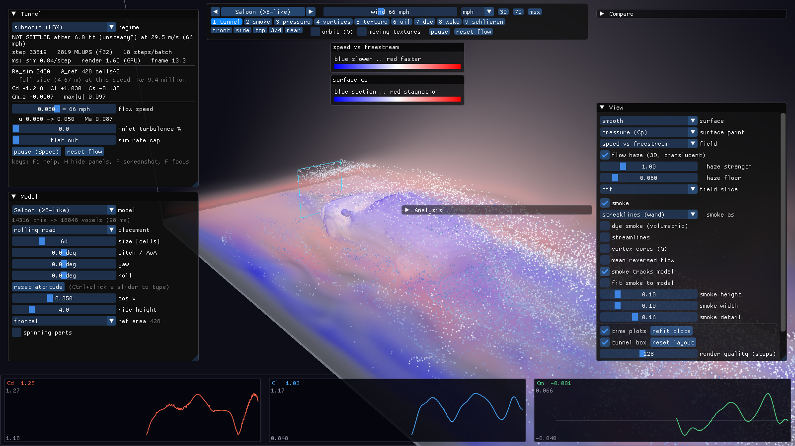
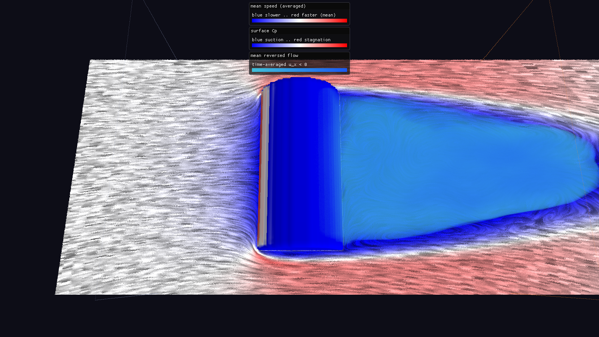
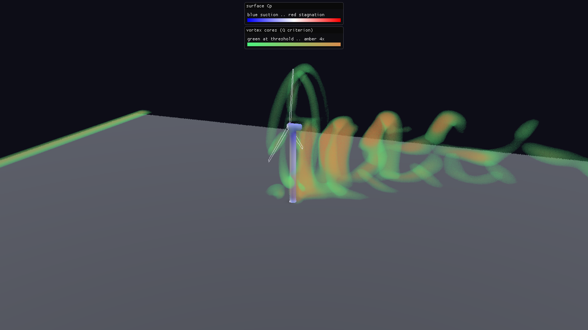
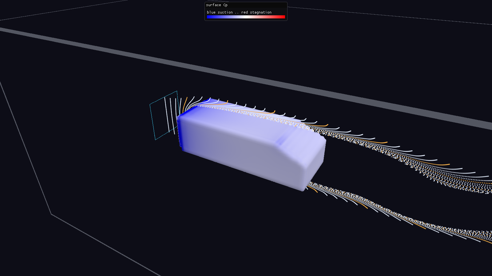
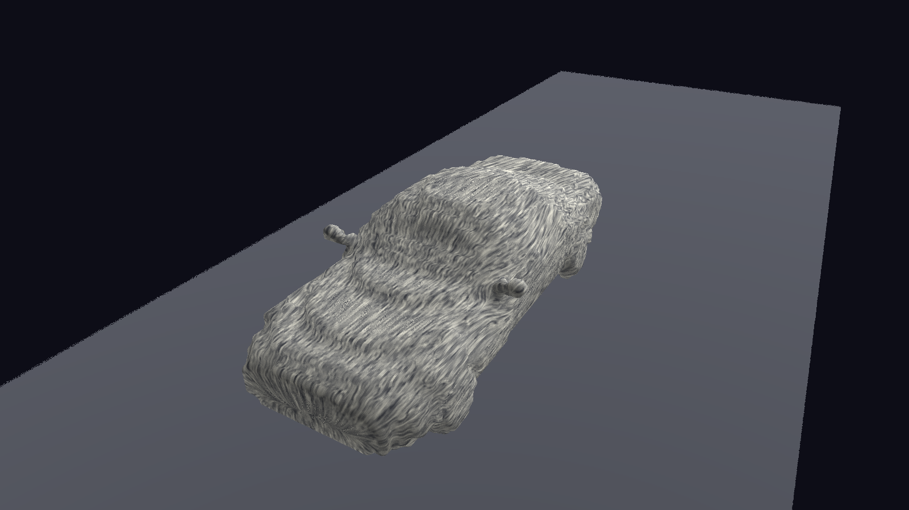
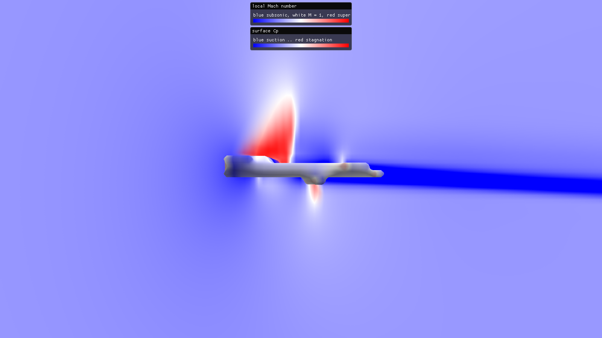
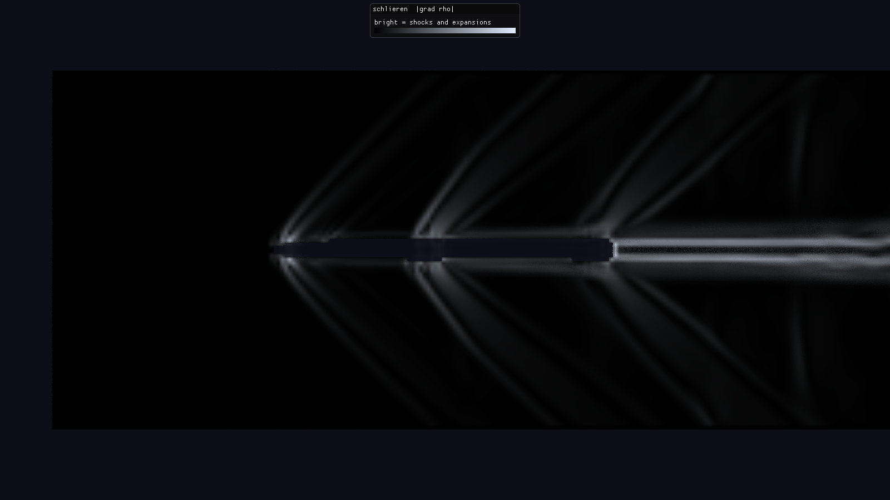

# wind-oa

An interactive three-dimensional wind tunnel on the GPU. A model (a car, an aircraft, a missile, a
building, a wind turbine) is placed in a virtual tunnel, air is blown over it, and the flow can be
explored as it develops: wakes, separation, vortices, shock waves and the pressure forces across the
body. Its moving parts move: wheels spin, rotors turn and load the air, and engines draw in and blow
out jets and exhaust plumes.

**Watching the flow is the point.** A slider moves and the wake, a trailing vortex pair or a shock
responds within seconds, while the force coefficients beside it come from the same solver the
validation gates check. The picture and the numbers can therefore be read together, and either can
be checked against the other.

Written in C++20 with Vulkan compute, a Dear ImGui front-end and a headless engine for the physics.



*The saloon in the rolling-road tunnel: smoke from the wand, the speed haze (blue slower, red
faster than the freestream) and the surface pressure, with the run status and forces on the left,
the quick bar along the top (the model, the wind in mph, the looks and the camera views), the view
controls on the right and the force histories along the bottom. Its wake is unsteady
enough that the settling detector reports it as such rather than declaring a mean.*

> **The tunnel runs at sandbox Reynolds numbers, about $10^3 - 10^4$, not at full scale.** Absolute
> coefficients are qualitative; the tunnel is for comparisons and trends.

## What it is for

A personal research and learning tool, built to make computational fluid dynamics tangible and
explorable rather than to stand in for an engineering design code. The goal is to take methods that
are usually met separately (lattice Boltzmann flow, compressible finite volumes, immersed
boundaries, passive transport) and make each one *do something visible* in the same tunnel, where its
consequences can be measured against a reference.

Three commitments follow from that, and they override convenience:

- **The physics is the product.** Every model is checked against an analytic solution, published
  data or a documented invariant *before* it is made fast or pretty. Correctness is testable;
  "looks right" is not. There are 31 such gates.
- **Headless and deterministic.** The solvers are a library with no window attached, and every
  reduction runs in a fixed order, so a run repeats bit for bit and a study needs no GUI.
- **Fast enough to be interactive.** The lattice Boltzmann solver runs at about 3,550 million cell
  updates per second on one GPU, on its own compute queue, so the window never waits for it.

One structural discipline underpins all of it: **every subsystem reduces to an exact identity when
switched off.** A tunnel with no spinning parts, no rotors, no inlet turbulence and no dye steps bit for bit as
it did before those features existed, rather than approximately. Every addition has been made safe
that way.

## Who it is for

Written for someone comfortable with code and curious about how air behaves around real shapes,
whether or not they have met fluid dynamics before. The documentation explains the vocabulary rather
than assuming it, and the guide is written so that somebody new to the subject could run the tunnel,
compare two configurations and read the numbers sensibly without reading any of the theory.

It is a study of simulation *methods*, not a design tool: it is not calibrated against any physical
wind tunnel, and its absolute coefficients are not predictions for full-scale objects.

## Six strands of physics

Each does a job the others cannot.

| Strand | Doing what | Lives in |
|---|---|---|
| **Lattice Boltzmann flow** | Subsonic air: D3Q19 streaming and collision (BGK, regularised, recursive), Smagorinsky LES | `lbm_step.comp`, `lbm.cpp` |
| **Boundary conditions** | Velocity inlet, pressure outlet and absorbing sponge, free-slip walls, bounce-back interpolated to the mesh's true surface (or half-way), moving walls, engine ports that blow and draw, rotors as actuator lines | `lbm_step.comp`, `shapes.cpp`, `rotor.cpp`, `alm_*.comp` |
| **Compressible Euler** | Transonic air: MUSCL reconstruction, HLLC flux, SSP-RK2, curvature-corrected image-point walls, engine exhausts with a prescribed exit state | `euler_*.comp`, `euler.cpp` |
| **Geometry** | Triangles to cells: a winding-number fill, a thin-feature shell, an exact signed distance; and back, by marching cubes | `vox_*.comp`, `voxeliser.cpp`, `catalogue.cpp`, `isosurface.cpp` |
| **Transport** | A passive dye on a D3Q7 lattice; synthetic, divergence-free inlet turbulence | `dye_step.comp`, `lbm_turb.comp`, `turb_blur.comp` |
| **Measurement** | Momentum-exchange forces reduced deterministically; a settling detector; a settled-flow cache; time averages, a wake survey that recovers the drag from the momentum balance, and spectra | `lbm_reduce.comp`, `convergence.cpp`, `flow_cache.cpp`, `flow_stats.cpp`, `spectrum.cpp` |

The loop is **solver-paced and display-sampled**: the solver steps flat out on the GPU's
asynchronous compute queue and publishes snapshots of its fields, and the renderer draws whichever
snapshot is newest on the graphics queue. That split is not a convenience; it is the structure.
Neither side waits for the other, so a slow frame never slows the physics, and a heavy batch of
physics never stutters the window.

## Gallery

Every image is a screenshot of the app, taken by its scripted mode (the commands are in
[docs/GUIDE.md](docs/GUIDE.md#37-screenshots-and-scripted-runs)).

| | |
|---|---|
|  |  |
| **The time-averaged wake of a cylinder.** A horizontal slice coloured by the mean speed, with a flow texture drawn along it; the translucent shell is the mean recirculation bubble. | **A wind turbine at its design tip-speed ratio.** The blades are actuator lines, drawn as outlines; vortex cores (the Q criterion) show the tip vortex they shed and the vortices shed by the tower. |
|  |  |
| **Pulsed timelines over the Ahmed body**, as from a hydrogen-bubble wire: each line leaves the wire at one instant, and its deformation shows the velocity profile. | **Oil-flow streaks on the saloon**: a texture smeared along the near-wall flow, as in a tunnel oil-film test. |
|  |  |
| **The NACA 0012 wing at Mach 0.8** in the compressible Euler regime: the supersonic pocket over the upper surface (red), closed by a shock. | **A missile at Mach 1.5 with its motor burning**, in schlieren (the density gradient): the shocks off the nose, the wings and the fins, and the hot exhaust plume behind the base. |

## Documentation

Three layers. Start at the top and go down only as far as the question needs.

| | Document | For |
|---|---|---|
| **1** | this page | What it is, and where everything is |
| **2** | **[docs/GUIDE.md](docs/GUIDE.md)** | **Setting up, driving the tunnel, getting numbers out, maintaining it.** The single source for operating it; start here to *use* it |
| **2** | [docs/MODEL.md](docs/MODEL.md) | How it works and how the parts interact: one solver step, the boundaries, the forces, a session from model to settled number, with worked numbers and the code path for each. Start here to *understand* it |
| **2** | [docs/REFERENCE.md](docs/REFERENCE.md) | Every tunable, solver option, catalogue model, command-line flag and control. The lookup table |
| **3** | [docs/THEORY.md](docs/THEORY.md) | The specification: every model derived from its general form, what was rejected on the way, and its limitations |
| **3** | [docs/VALIDATION.md](docs/VALIDATION.md) | The 31 gates, what each is checked *against*, and how to add one |

### Two numbering schemes

The prose leans on both, so they are worth thirty seconds up front:

- **§N.M** is a section of [docs/THEORY.md](docs/THEORY.md); §3.3 is the outlet sponge. The source
  cites the same sections as `THEORY N.M` (the source is kept ASCII), which is why sections are
  never renumbered.
- **V1 - V31** is a *validation gate*: one property checked against an external reference. V17 is
  "the shock tube matches the exact Riemann solution".

Neither is a hierarchy to be learned. They are stable names, so a claim made in one place can be
checked in another.

### Abbreviations

The documentation expands each of these on first use, but they are gathered here so that a reader
arriving part-way through has somewhere to look.

| | | | |
|---|---|---|---|
| **BGK** | Bhatnagar-Gross-Krook (single relaxation time) | **MLUPS** | Million Lattice Updates Per Second |
| **CFD** | Computational Fluid Dynamics | **MUSCL** | Monotone Upstream-centred Scheme for Conservation Laws |
| **CFL** | Courant-Friedrichs-Lewy (the time-step limit) | **Q** | The Q criterion (vortex identification) |
| **Cd, Cl, Cs, Cm** | Drag, lift, side-force and moment coefficients | **Re** | Reynolds number |
| **D3Q19, D3Q7** | Three-dimensional lattices with 19 and 7 velocities | **RR** | Recursive Regularised (collision) |
| **HLLC** | Harten-Lax-van Leer-Contact (Riemann solver) | **SSP-RK2** | Strong-Stability-Preserving Runge-Kutta, second order |
| **IBB** | Interpolated Bounce-Back | **St** | Strouhal number |
| **LBM** | Lattice Boltzmann Method | **STL** | Stereolithography (a triangle-mesh file format) |
| **LES** | Large-Eddy Simulation | **TRT** | Two-Relaxation-Time (collision) |
| **LIC** | Line-Integral Convolution (a texture drawn along the flow) | **Tu** | Turbulence intensity |
| **Ma** | Mach number | | |

## Layout

```
engine/      the headless core: Vulkan context, the LBM and Euler solvers, dye, the
             voxeliser, actuator-line rotors, the procedural catalogue and the Tunnel
             sandbox. No window, no GUI
render/      the ray-marched volume renderer, vortex cores, smoke and streamlines
app/         Win32 window + Dear ImGui (docking); the solver on a worker thread
tools/       headless runners (tunnel_run, lbm_run, euler_run), the benchmark and
             the bit-identity checks
validation/  the V1-V31 gates, one executable each, checked through the public API only
third_party/ Dear ImGui, vendored (a pinned, unmodified copy)
docs/        the five documents above, and the images on this page
```

The dependency arrows only point one way: `app -> render -> engine`, and `tools / validation ->
engine`. **`engine` never depends on the window or the GUI.** That boundary is what keeps the physics
independently testable and the solvers runnable headless, and it is never bent. Nothing is downloaded
at build time: the engine needs only the Vulkan SDK, the app adds Dear ImGui, and everything else (the
STL parser, the voxeliser, marching cubes, the PNG writer, the test harness) is written here.

## Quick start

Requires Visual Studio 2022 (the "Desktop development with C++" workload), CMake 3.25 or newer and
the LunarG Vulkan SDK. From the repository root:

```
cmake --preset dev                          # configure (Visual Studio 2022, x64)
cmake --build --preset dev                  # build (RelWithDebInfo)
ctest --preset quick                        # the smoke checks and the short gates (about 105 s)
build\app\RelWithDebInfo\windoa_app         # the interactive tunnel
```

The first build compiles Dear ImGui and every shader and takes a minute or two; iterative rebuilds
take seconds.

Then ask it something:

```
# Does storing the distributions in half precision change the answer?
build\tools\RelWithDebInfo\tunnel_run --model ahmed_25deg --batches 300 --steps 100 --no-cache
build\tools\RelWithDebInfo\tunnel_run --model ahmed_25deg --batches 300 --steps 100 --no-cache --f16
```

```
--- f32
step   30000  u 0.0500  Cd +0.6798  Cl +0.0981  Cm +0.0172  max|u| 0.066  SETTLED after 2.5 flow-throughs  (3240 MLUPS)
second-half mean: Cd 0.6779 (sd 0.0013)  Cl 0.0960 (sd 0.0102)  over 150 batches
--- f16
step   30000  u 0.0500  Cd +0.6755  Cl +0.0940  Cm +0.0162  max|u| 0.066  SETTLED after 2.5 flow-throughs  (4022 MLUPS)
second-half mean: Cd 0.6768 (sd 0.0052)  Cl 0.0947 (sd 0.0052)  over 150 batches
```

Half precision runs 24 % faster per step, and its mean drag is 0.2 % lower. However, its scatter is
4 times larger, so matching the f32 run's confidence in the mean needs 16 times as many samples:
for a time-averaged coefficient, the faster storage is the slower route, by a factor of about 13.
(Its lift spectrum also misses the shedding peak at St 0.135 that the f32 run finds, and carries a
spurious one at 0.64.) This is not a defect in the storage scheme,
which keeps its precision where the physics is (§11.3); it is the useful kind of negative result,
and it exists only because the slower path was kept and measured rather than retired once the faster
one worked. Half precision is therefore off by default, and it is not gated: every gate runs f32.

Your own model: drop an STL file into `models/` (nose towards $-x$) and it appears in the app's
model menu under *Imported*. `tunnel_run --stl FILE` runs it headless, and `--csv FILE` gathers
runs of several models into one table for comparison ([GUIDE §10](docs/GUIDE.md#comparing-several-models)).

See [docs/GUIDE.md](docs/GUIDE.md) for everything else.

## Status

The tunnel covers subsonic flow by the lattice Boltzmann method (regularised collision with an LES
model, walls at the mesh's true surface by interpolated bounce-back, moving walls for spinning
wheels and a rolling road, engine ports that blow and draw, rotors as actuator lines, and an
absorbing outlet), transonic flow by a compressible Euler solver with curvature-corrected ghost-cell
walls and under-expanded exhaust plumes, a 30-model procedural catalogue with a winding-rule
voxeliser, marching cubes, dye, synthetic inlet turbulence, a settling detector and a settled-flow
cache, on grids up to 18.9 million cells. On top of the flow sit time averages, a wake survey that
measures the drag a second way, probes and spectra; the views run from vortex cores and dye to
oil-flow streaks, flow textures, arrows and pulsed timelines, in an interactive app with the solver
on its own GPU queue, with a quick bar for play: the wind in mph or km/h with a sweep, nine
one-key looks, gliding camera views and an orbit, click to place, colour maps and frame recording.
The model is drawn in its true shape from its own triangles, or as the cells the solver sees, and
the interface scales with the monitor and a UI scale of its own. Your own STL models run in the app
and headless, and results collect into CSV tables for comparison. All 31 validation gates hold,
each against its external reference. The project is complete in this form: further work would be
new physics, each gated before it is made fast.

Each theory section states the limitations its model accepts. The largest is the Reynolds number: at
about $10^3$ the tunnel reads the Ahmed body's drag at about 1.4, against 0.285 in experiment at full
scale, so absolute coefficients are qualitative and comparisons are what the tunnel is for
([§4.5](docs/THEORY.md#45-deliberate-limitations)). Half-precision storage stays an opt-in,
ungated approximation ([docs/VALIDATION.md](docs/VALIDATION.md#what-is-deliberately-not-gated)).

## Licence

MIT; see [LICENSE](LICENSE). The vendored Dear ImGui carries its own MIT licence
([third_party/imgui/LICENSE.txt](third_party/imgui/LICENSE.txt)).
