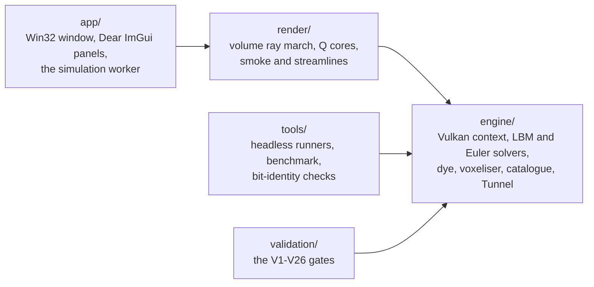
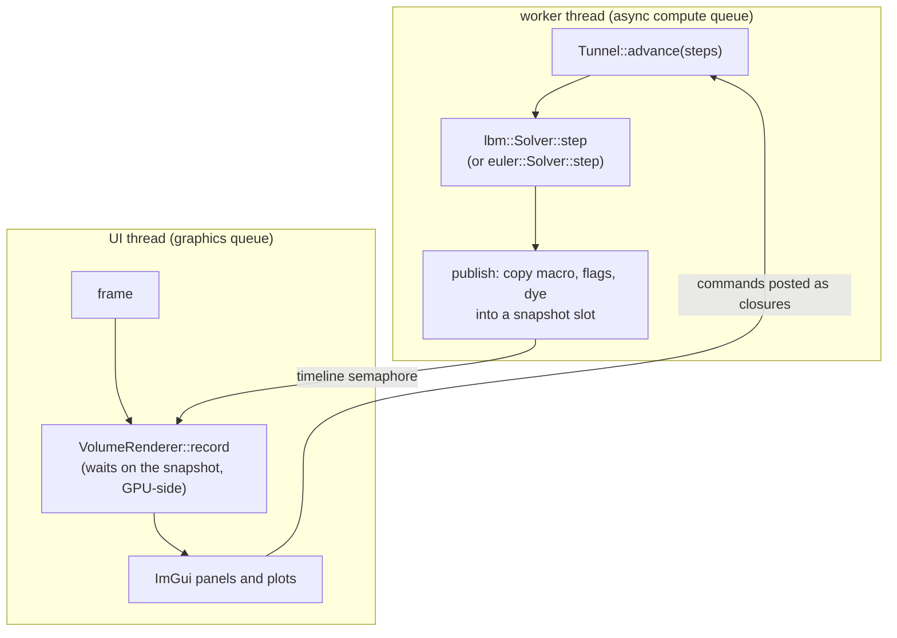
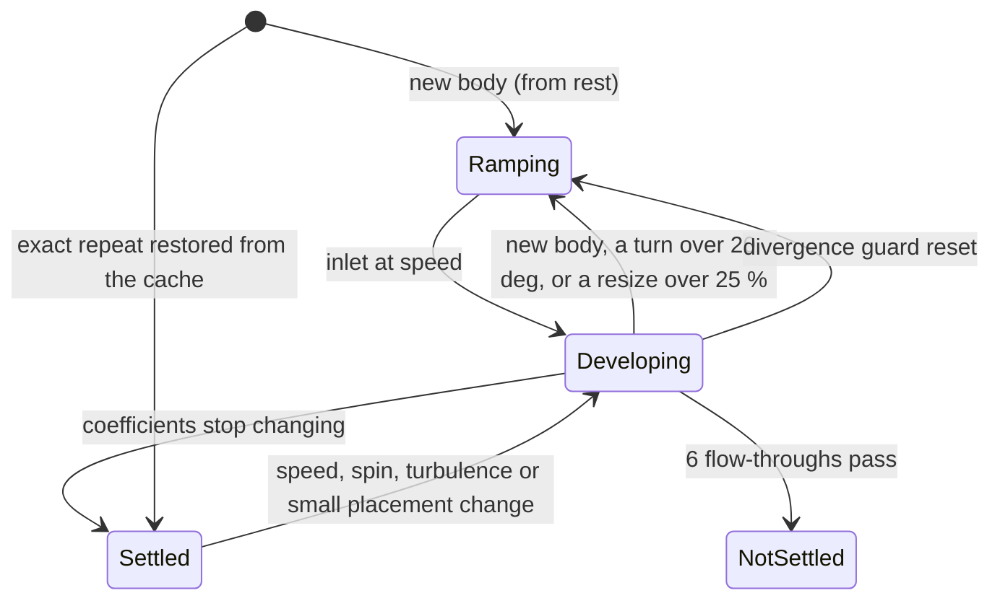

# How the model works

What the pieces are, how they fit together, and what happens while the tunnel runs. It assumes no
C++ and no fluid dynamics, and every number in it was measured on the real solver or computed from
the code's own formulas rather than worked out by hand.

This is the explanatory layer. [`docs/GUIDE.md`](GUIDE.md) describes how to set the tunnel up and
drive it; [`docs/REFERENCE.md`](REFERENCE.md) is the lookup table of every flag and tunable;
[`docs/THEORY.md`](THEORY.md) is where each equation is derived and stated properly. To understand
the tunnel, read this page first: it is the map the other three hang off. Sections of the theory are cited as §N.M
and validation gates as VN.

## Contents

1. [The shape of it](#1-the-shape-of-it)
2. [How the parts couple](#2-how-the-parts-couple)
3. [Grids, units and what the numbers mean](#3-grids-units-and-what-the-numbers-mean)
4. [One solver step, end to end](#4-one-solver-step-end-to-end)
5. [What the air meets](#5-what-the-air-meets)
6. [Forces, and turning them into coefficients](#6-forces-and-turning-them-into-coefficients)
7. [From triangles to cells](#7-from-triangles-to-cells)
8. [A session, from choosing a model to a settled number](#8-a-session-from-choosing-a-model-to-a-settled-number)
9. [Dye and inlet turbulence](#9-dye-and-inlet-turbulence)
10. [Measuring the flow: averages, the wake survey and spectra](#10-measuring-the-flow-averages-the-wake-survey-and-spectra)
11. [Transonic mode](#11-transonic-mode)
12. [What is drawn, and from what](#12-what-is-drawn-and-from-what)
13. [The identity discipline](#13-the-identity-discipline)
14. [Performance, and why it cannot change results](#14-performance-and-why-it-cannot-change-results)
15. [Where to change things](#15-where-to-change-things)

## 1. The shape of it

The project is three layers and two kinds of client, and the dependencies point one way only.

- **`engine/`** is the physics, as a library with no window. It owns the Vulkan compute context,
  the lattice Boltzmann solver, the compressible Euler solver, the dye, the voxeliser, the 30
  procedural models and the `Tunnel`, which is the sandbox's rules (placement, spin, ground,
  settling, the flow cache).
- **`render/`** draws the flow from snapshots of the engine's buffers.
- **`app/`** is the interactive program: the window, the panels, and a worker thread that runs
  the `Tunnel`.
- **`tools/`** and **`validation/`** drive the engine directly, without a window.

`engine/` never includes a window or GUI header. That boundary keeps the physics testable
headless, which is what lets 26 gates run the same code the app runs.

## 2. How the parts couple

The solver and the renderer run on different GPU queues and different threads, and neither waits
for the other.

The worker runs batches of solver steps sized to about 16 ms of GPU time, and after a batch copies
the fields the renderer needs into one of two snapshot slots, signalling a timeline semaphore. A
frame takes the latest published slot and makes its own GPU submission wait for that semaphore
value, so the CPU never blocks. Before overwriting a slot, the worker waits until every frame that
read it has finished. Commands from the panels (a new model, a speed change) are closures run on
the worker between batches, so the `Tunnel` is only ever touched by one thread.

**The code path:** `app/src/sim.cpp` (`SimWorker::run`, `publish`), `app/src/app.cpp` (the frame),
`render/src/volume.cpp` (`VolumeRenderer::record`).

## 3. Grids, units and what the numbers mean

The solver works in *lattice units*: a cell is one unit long and a step is one unit of time
(§1.2). Three presets set the grid:

| Preset | Grid | Cells |
|---|---|---|
| fast (default) | 256 x 96 x 96 | 2.36 million |
| balanced | 320 x 128 x 128 | 5.24 million |
| fine | 384 x 160 x 160 | 9.83 million |

The default freestream is $U = 0.05$ cells per step, which is Mach 0.087 (the lattice sound speed
is $1/\sqrt{3}$). The relaxation time $\tau = 0.504$ sets the viscosity
$\nu = (\tau - 0.5)/3 = 0.00133$. A model 64 cells long is therefore simulated at

$$\mathrm{Re} = \frac{U L}{\nu} = \frac{0.05 \times 64}{0.00133} = 2{,}400,$$

which is the "Re_sim" on the Tunnel panel. A real car at motorway speed is near $4 \times 10^6$:
the tunnel works three orders of magnitude lower, so absolute drag coefficients are qualitative and
*comparisons* are what it is for (§4.5).

Time is easiest to read in **flow-throughs**: one flow-through is the time for the freestream to
cross the tunnel, $n_x / U = 256 / 0.05 = 5{,}120$ steps on the fast grid. At the 3,272 million
lattice updates per second measured in the sandbox, the fast grid advances 1,386 steps a second,
so one flow-through takes 3.7 s. A wake typically settles in 2 - 4.5 flow-throughs; the Ahmed body
from rest settled after 14,000 steps (2.55 flow-throughs, about 10 s).

## 4. One solver step, end to end

One step is one GPU dispatch over every cell, and a batch of steps is recorded into a single
submission (about 20 per 16 ms batch in the app on the fast grid; 100 in the headless runs
quoted here). For each fluid cell, the kernel `engine/shaders/lbm_step.comp` does five things:

1. **Pull.** For each of the 19 lattice directions it fetches the distribution arriving from the
   upwind neighbour. If that neighbour is outside the grid or solid, a boundary rule supplies the
   value instead (§3, and section 5 below). Where the neighbour is part of the model, the
   momentum exchanged across that link is added to the cell's force and torque.
2. **Moments.** The density and velocity are the sum and the first moment of the 19 values.
3. **Eddy viscosity.** The Smagorinsky model reads the strain from the same 19 values (§2.5); no
   neighbour's velocity is needed.
4. **Collide.** The distributions relax towards equilibrium, with the regularised operator in the
   app (§2.3), and the outlet sponge applies near the end of the tunnel (§3.3).
5. **Write.** The new distributions go to the second buffer (the two alternate every step), and
   density and velocity are written where something will read them (§11.1).

Each workgroup of 256 cells then sums its force and torque in a fixed-order tree, and a small kernel
(`lbm_reduce.comp`) folds the workgroup totals into the step's force and into a running window sum,
always in the same order, so a run repeats bit for bit (§4.3).

**The code path:** `lbm::Solver::step` (`engine/src/lbm.cpp`) records the dispatches;
`lbm_step.comp` `process()` is the per-cell work above; `main()` holds the force tree.

## 5. What the air meets

| Where | Rule | Theory |
|---|---|---|
| Inlet plane (x = 0) | Pinned to the freestream equilibrium every step | §3.1 |
| Outlet (x = n_x - 1) | Density pinned to 1, velocity from the last interior plane one step earlier | §3.2 |
| The last 24 cells | Relaxed towards the freestream, absorbing sound | §3.3 |
| Side walls | Free-slip: a mirror for the populations, so no friction, no boundary layer, no mass gained or lost, and sound reflected perfectly | §3.4 |
| The model | Bounce-back at every link: a no-slip wall half a cell outside its cells | §3.5 |
| Spinning parts, rolling road | Bounce-back plus the wall's own velocity | §3.7 |

The outlet's sound reflection is the reason for the sponge: without it, 69 % of a pressure pulse
returned up the tunnel and fogged both the picture and the drag signal. With it, 1.0 % returns, and
the Ahmed body's drag moves by 0.20 % (V10).

## 6. Forces, and turning them into coefficients

The force on the model is summed from every link between a fluid cell and a model cell (§4.1). For
the Ahmed body on the fast grid, the frontal area is 432 cells (the number of cells in the model's
shadow along the flow), and the dynamic pressure at $U = 0.05$ is
$q = \tfrac12 U^2 = 0.00125$. Its settled drag coefficient of 0.714 therefore corresponds to a
force of

$$F_x = C_D\, q\, A = 0.714 \times 0.00125 \times 432 = 0.386$$

in lattice units per step: a sum of order 0.4, which is why the window adds once per step rather
than once per link (§4.3).

The Tunnel panel smooths the per-batch mean forces with a moving average whose time constant is 120
steps, so a shedding wake reads as a steady number with a small wobble. The reference area can be
switched between frontal (road vehicles), planform (wings) and a manual value; a wing's lift
coefficient only looks right against its planform area.

**The code path:** the link sums in `lbm_step.comp`; `lbm_reduce.comp`; `Tunnel::advance` and
`Tunnel::status` (`engine/src/tunnel.cpp`) for the averaging and the coefficients.

## 7. From triangles to cells

A model arrives as a triangle mesh (a catalogue model built in memory, or an STL file) and leaves as
cell flags. The voxeliser runs five GPU passes (§5):

1. **Winding** (three times, once per axis): each grid column collects the triangles crossing it,
   and each cell centre counts the signed crossings beyond it. Non-zero means inside, and the cell
   gets a vote.
2. **Votes:** two votes out of three make the cell solid.
3. **Shell, mark:** every cell a triangle passes through records its nearest triangle.
4. **Shell, apply:** a marked cell becomes solid only where the feature is thinner than about 1.5
   cells, so wing tips and fins survive as continuous sheets while a thick body keeps its exact
   shape.
5. **Distance** (transonic mode only): the exact distance from each nearby cell centre to the
   surface.

The catalogue's sphere is 3,968 triangles; fitted to 16 cells it becomes 2,176 solid cells, 3.2 %
more than the analytic ball of the same diameter (a shell of edge cells legitimately differs), and
its drag is within 1.9 % of the analytic sphere's (V13). A rotated box voxelises to exactly the
cells whose centres it contains, and a plate 0.3 cells thick becomes a sheet no link can cross
(V12).

The reverse direction, from a sampled field back to triangles, is marching cubes (§10.5). Nothing
is drawn with it, since the renderer ray-marches its surfaces, but it is gated on its own: the
iso-surface of an analytic sphere's distance field comes out closed, its vertices within about
0.01 cells of the sphere and its area within 0.3 % (V16).

**The code path:** `Voxeliser::voxelise` (`engine/src/voxeliser.cpp`) and the `vox_*.comp`
shaders; placement in `Tunnel::placed_mesh`; `marching_cubes` (`engine/src/isosurface.cpp`).

## 8. A session, from choosing a model to a settled number

Choosing a model applies its natural setting: a size that resolves it, a placement (free air, a
rolling road for road vehicles, a fixed floor for buildings) and a position fitted so the nose
clears the inlet. The model is voxelised, the flow restarts from rest, and the inlet ramps up over
2,000 steps, because an impulsive start once reached a local speed of 0.31 (§9.1).

The panel then shows **DEVELOPING** while the wake forms and washes through. A detector watches the
drag and lift coefficients in windows of half a flow-through and declares **SETTLED** once
consecutive windows agree to 1 %, including an extrapolation for a slow monotone approach (§9.5).
At that point the flow is saved to the cache: coming back to exactly that configuration later
restores it in well under a second, and V23 checks that a restored flow behaves exactly like one
that never left.

Small changes keep the flow and only restart the detector; a new body, or a large turn or resize,
restarts from rest. If the flow blows up (most often from a very high speed, a thin under-body gap
or spin), the guard resets it with a note naming the likely cause, and a second blow-up within a
minute pauses the tunnel (§9.4).

**The code path:** `Tunnel::set_model`, `revoxelise`, `begin_operating_point`, `advance` and
`diverged` (`engine/src/tunnel.cpp`); `ConvergenceMonitor` (`engine/src/convergence.cpp`);
`FlowCache` (`engine/src/flow_cache.cpp`).

## 9. Dye and inlet turbulence

**Dye** is a concentration carried by the flow on its own small lattice (§6). Nozzles on the smoke
wand hold it at full strength, and it spreads at a small, physical diffusivity (0.0075 cells^2 per
step), filling the wake like theatrical smoke. It uses the same walls as the flow, so it can never
leak into the model, and it steps once per flow step, in the same GPU submission.

**Inlet turbulence** reproduces the slight unsteadiness of real tunnel air (§7). A gust field is
built once as the curl of a smoothed random field, which makes it divergence-free, and is carried
in through the inlet at the freestream speed. Being divergence-free is what keeps it quiet: the
same intensity of ordinary noise made five times as much sound (V21). At 1 % it changed the Ahmed
body's drag by 0.75 %.

## 10. Measuring the flow: averages, the wake survey and spectra

A wake that sheds is never still, so the numbers worth having from it are averages and
frequencies (§12). All three measurements read the solver's fields and never write them.

**Time averages.** With averaging on, every batch of a settled flow adds a sample to a running
mean and variance of each cell's velocity and density, updated in place on the GPU. Each update
is taken relative to the sample (Welford's recurrence), so a long window loses no precision in
f32. From them come the mean-speed and turbulence-intensity fields and the mean recirculation
bubble. On the shedding cylinder of V24, thirty cycles of averaging leave the mean wake symmetric
to 0.01 % of U, while every instantaneous field is asymmetric by more than U; the transverse
fluctuation peaks on the centreline and the streamwise one off it, as in a Karman street.

**The wake survey.** Between the upstream reference plane and a survey plane behind the model,
the drag must equal the fall in the averaged flow's momentum flux, because the side walls carry no
streamwise force. The survey sums the momentum flux, the pressure and the viscous stress over
each plane's fluid cells and sets the result beside the force balance's mean over the same
window: two independent measurements of one force. On the app's Ahmed body they agree to 0.5 %
(V25).

**Spectra and probes.** The batch-mean lift and up to four probes are recorded every batch, and
their spectra are taken over the developed part of the last 16 flow-throughs; a peak's frequency
becomes a Strouhal number on the body's height. Sound rings between the side walls at multiples of
$c_s / (2 n_y)$, every 333 steps on the fast grid, and shows in every spectrum, so the shedding
peak is reported separately, below the first acoustic mode. On the cylinder of V7 the lift
spectrum gives St 0.212 (published 0.196), and a probe on the wake centreline sees the transverse
velocity at the shedding frequency and the streamwise velocity at twice it (V26).

**The code path:** `FlowStats` and `plane_momentum_flux` (`engine/src/flow_stats.cpp`,
`stats_accumulate.comp`); `spectrum` (`engine/src/spectrum.cpp`); `Tunnel::record_signals` and
`Tunnel::refresh_analysis` (`engine/src/tunnel.cpp`).

## 11. Transonic mode

The lattice Boltzmann solver cannot form shocks. Switching the regime to TRANSONIC hands the same
tunnel and model to the compressible Euler solver (§8): the body is voxelised into the Euler grid
with its exact signed distance, and the flow starts impulsively from the freestream. The Mach
slider replaces the speed, the panel shows the peak local Mach number, and the coefficients are
pressure and wave drag only, since the solver is inviscid. Smoke, dye, vortex cores and spin step
in lattice time and are subsonic-only; switching back resumes the paused lattice flow where it
left off.

In the Euler solver's units the freestream speed *is* the Mach number and the sound speed is one,
so time is counted in cell sound-crossings. It develops for two flow-throughs after a switch or a
new model.

## 12. What is drawn, and from what

Each frame the renderer runs a few compute passes over the latest snapshot:

1. **Prepare:** the chosen field (speed, pressure, vorticity, Mach, schlieren, or from the
   averages the mean speed and the turbulence intensity) is computed once per cell into a
   normalised value (§10.1, §12.1), with the mean streamwise velocity when the reversed-flow
   shells are on.
2. **Q** (every third frame): the vortex-core criterion from a smoothed velocity, with an adaptive
   threshold computed on the GPU (§10.3).
3. **March:** one ray per pixel, front to back, accumulating the model surface, the slice plane,
   the vortex cores, the mean reversed-flow shells, the dye and the field haze. Opacity comes from
   the deviation from the freestream, so undisturbed air is transparent and only what the model
   changes shows. The surface can be painted with Cp, with the speed or direction of the flow one
   cell off it, or with oil-flow streaks: noise smeared along that near-wall flow by a
   line-integral convolution, so the streaks trace the skin-friction lines (§10.7). The slice can
   carry the same texture of its in-plane flow (§10.8).
4. **Splats:** smoke particles (streaklines, or timelines from a pulsed line), streamline
   segments, velocity arrows on the slice, the probe crosses and the wake-survey planes,
   depth-tested against the marched image (§10.9).

The ray march samples 3-D textures, so the GPU's texture units do the trilinear interpolation. On
the fast grid a frame's rendering costs about 0.7 ms of GPU time with the haze alone, and
1.5 - 2 ms with vortex cores, dye and streamlines on as well; the slice texture and the oil-flow
paint add about 0.3 - 0.5 ms each at 1600 x 900.

## 13. The identity discipline

Every optional feature reduces to an exact identity when it is off (§0.7). A tunnel with no
spinning parts, no inlet turbulence and no dye steps bit for bit as it did before those features
existed. The switches that select a feature at compile time are specialisation constants, so the
disabled code is absent from the kernel the driver builds; the switches that act at run time (the
inlet turbulence intensity, for example) skip their work entirely at zero. This is what makes it
safe to add a feature: if the result with it off changes at all, something else has been changed
too.

## 14. Performance, and why it cannot change results

The solver runs at about 3,550 million lattice updates per second in f32 (about 4,800 with the
optional half-precision storage); the Euler solver runs at about 2,300 million cell-steps per
second. Those speeds came from changes that do not
alter the arithmetic (§11): writing density and velocity only when they are read, and skipping the
force reduction where no model link exists. Each is checked bit for bit against the code with the
switch off, and against results saved from the kernel as it was before the work (`P4_equiv`).

Half-precision storage is the exception, and it is labelled as one. It is about a third faster in the
sandbox, but it at least doubles the batch-to-batch scatter of the drag, so the same confidence in a
mean costs more time, not less (the Quick start in the README shows the measurement). It is
therefore off by default.

## 15. Where to change things

| To change | Look in |
|---|---|
| A tunnel tunable (speed limits, ramp, sponge, cap, guard, dye, cache budget) | `TunnelSettings` in `engine/include/windoa/tunnel.hpp` |
| A solver option (collision, LES, boundaries) | `lbm::Config` in `engine/include/windoa/lbm.hpp` |
| The compressible solver's options | `euler::Config` in `engine/include/windoa/euler.hpp` |
| A catalogue model or its spinning parts | `engine/src/catalogue.cpp` |
| The settling thresholds | `ConvergenceMonitor` in `engine/include/windoa/convergence.hpp` |
| What is drawn, and how | `render/src/volume.cpp`, `render/src/tracers.cpp` and `render/shaders/` |
| Averages, the wake survey, spectra | `engine/src/flow_stats.cpp`, `engine/src/spectrum.cpp`, `Tunnel::refresh_analysis` |
| The panels | `app/src/app.cpp` |

### Checking that nothing is broken

- `ctest --preset quick` runs the smoke checks and the 14 short gates in about 80 s.
- `build\tools\RelWithDebInfo\lbm_equiv --check build\p4_orig` confirms the lattice Boltzmann
  solver still produces the same bits; `euler_run equiv --check build\p4_euler` does the same for
  the Euler solver. A change that is meant to alter the physics will fail these by design: in that
  case, run the gates instead.
- `ctest --preset dev` runs everything, all 26 gates included, in about 13 minutes.

If a gate fails after a change, the reason should be understood before any tolerance is changed:
see [`docs/VALIDATION.md`](VALIDATION.md).
